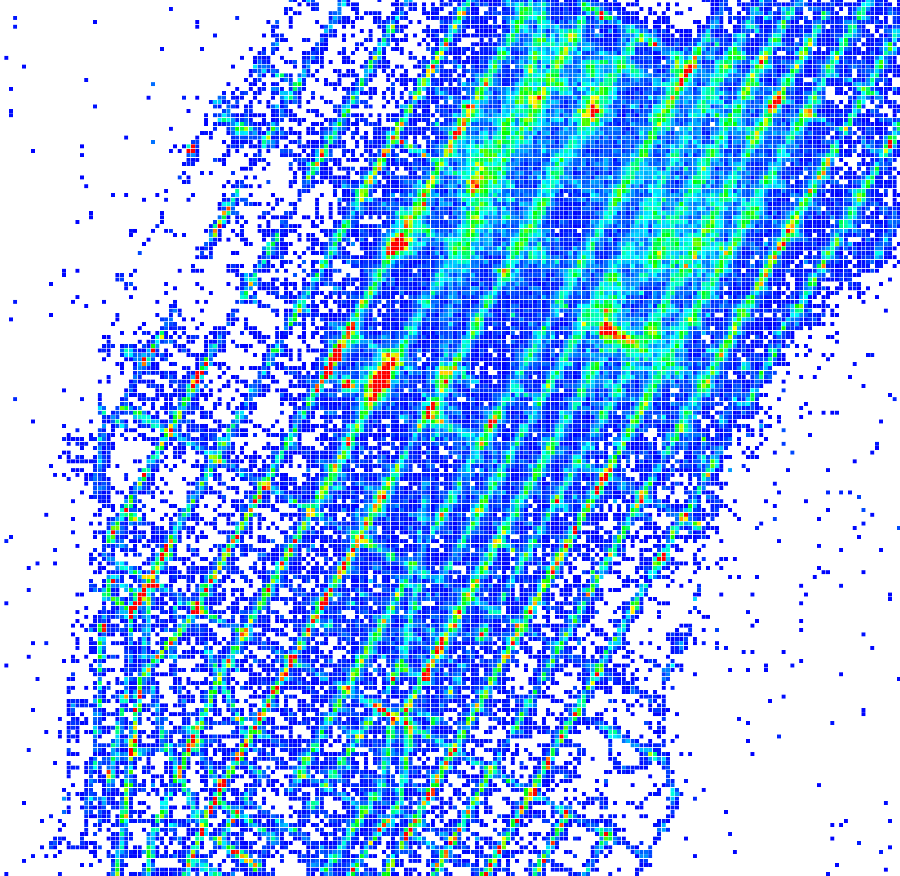

# fishnet_map_layer

绘制一个鱼网图，需要先后调用 vega_fishnetmap 和 fishnet_map_layer 两个接口，首先使用 vega_fishnetmap 构建描述鱼网图渲染样式的 VegaFishNetMap 对象，然后使用 fishnet_map_layer 渲染图像。

## vega_fishnetmap 

**arctern.util.vega.vega_fishnetmap(width,height,bounding_box,color_gradient,
cell_size,cell_spacing,opacity,coordinate_system,aggregation_type)**

&#x2002; &#x2003; 根据给定的配置参数，构建描述鱼网图渲染样式的 VegaFishNetMap 对象。

&#x2002; &#x2003; 参数

&#x2002; &#x2003; &#x2002; &#x2003; * width(int) -- 图片宽度，单位为像素个数。

&#x2002; &#x2003; &#x2002; &#x2003; * height(int) -- 图片高度，单位为像素个数。

&#x2002; &#x2003; &#x2002; &#x2003; * bounding_box(list) -- 图片对应的地理坐标区域，以 [x_min, y_min, x_max, y_max] 的形式表示一个矩形区域。图片左下角的像素坐标 (0, 0) 对应地理坐标 (x_min, y_min) ，图片右上角的像素坐标 (width, height) 对应地理坐标 (x_max, y_max)。

&#x2002; &#x2003; &#x2002; &#x2003; * color_gradient(list) -- 点的颜色渐变范围，表示形式为 ["hex_color"] 或 ["hex_color1", "hex_color2"]。当形式为["hex_color"] 时所有点的颜色相同。当形式为["hex_color1", "hex_color2"] 时点的颜色由输入数据中一列的值（权重）决定，且颜色在 "hex_color1" ~ "hex_color2" 之间变化。

&#x2002; &#x2003; &#x2002; &#x2003; * cell_size(int) -- 可选参数，表示鱼网网格的宽，默认值为 4。

&#x2002; &#x2003; &#x2002; &#x2003; * cell_spacing(int) -- 可选参数，表示鱼网网格之间的间隔，默认值为 1。

&#x2002; &#x2003; &#x2002; &#x2003; * opacity(float) -- 可选参数，表示点的不透明度，范围为 0.0 ~ 1.0，默认值为 1.0。

&#x2002; &#x2003; &#x2002; &#x2003; * coordinate_system(str) -- 可选参数，表示输入数据所属的地理坐标系统，默认值为"EPSG:3857"，当前支持的地理坐标系统请参照 <https://spatialreference.org/>。

&#x2002; &#x2003; &#x2002; &#x2003; * aggregation_type(str) -- 可选参数，表示输入数据到鱼网网格权重的聚合方式，默认值为"sum"。


&#x2002; &#x2003; 返回值类型

&#x2002; &#x2003; &#x2002; &#x2003; arctern.util.vega.fishnetmap.vega_fishnetmap.VegaFishNetMap


&#x2002; &#x2003; 返回

&#x2002; &#x2003; &#x2002; &#x2003; 用于描述渲染样式的 VegaFishNetMap 对象。


## fishnet_map_layer 

**arctern.fishnet_map_layer(vega, points, weights)**

&#x2002; &#x2003; 绘制鱼网图，权重用于决定鱼网网格的颜色。

&#x2002; &#x2003; 参数

&#x2002; &#x2003; &#x2002; &#x2003; * vega(VegaFishNetMap) -- VegaFishNetMap 对象。

&#x2002; &#x2003; &#x2002; &#x2003; * points(Series(dtype: object)) -- 所需绘制的鱼网网格的位置，格式为WKB。

&#x2002; &#x2003; &#x2002; &#x2003; * weights(Series(dtype: float64|int64)) -- 鱼网网格的颜色权重。


&#x2002; &#x2003; 返回值类型
   
&#x2002; &#x2003; &#x2002; &#x2003; bytes


&#x2002; &#x2003; 返回

&#x2002; &#x2003; &#x2002; &#x2003; base64编码的png图片。


### 示例:

  ```python
      >>> import pandas as pd
      >>> import numpy as np
      >>> import arctern
      >>> from arctern.util import save_png
      >>> from arctern.util.vega import vega_fishnetmap
      >>> 
      >>> # 读取 csv 文件并创建绘图数据
      >>> # test_data.csv下载链接: https://github.com/zilliztech/arctern-resources/raw/benchmarks/benchmarks/dataset/layer_rendering_test_data/test_data.csv
      >>> df = pd.read_csv("/tmp/test_data.csv", dtype={'longitude':np.float64, 'latitude':np.float64, 'color_weights':np.float64, 'size_weights':np.float64, 'region_boundaries':np.object})
      >>> region = arctern.ST_GeomFromText(pd.Series(['POLYGON ((-74.01424568752932 40.72759334104623, -74.01424568752932 40.76721122683304, -73.96056823889673 40.76721122683304, -73.96056823889673 40.72759334104623, -74.01424568752932 40.72759334104623))']))
      >>> d=pd.DataFrame(region).T
      >>> region = region.append([d]*(df.shape[0] - 1))
      >>> in_region = arctern.ST_Within(arctern.ST_Point(df['longitude'], df['latitude']), region[0])
      >>> df['in_region']=in_region
      >>> input1 = df[df.in_region == True].reset_index()
      >>> 
      >>> points = arctern.ST_Point(input1['longitude'], input1['latitude'])
      >>> 
      >>> # 根据 input1['color_weights'] 绘制鱼网图
      >>> vega = vega_fishnetmap(1824, 1777, bounding_box=[-74.01424568752932, 40.72759334104623, -73.96056823889673, 40.76721122683304], cell_size=8, cell_spacing=2, opacity=1.0, coordinate_system="EPSG:4326")
      >>> png = arctern.fishnet_map_layer(vega, points, input1['color_weights'])
      >>> save_png(png, "/tmp/python_fishnet_map.png")
   ```

渲染结果如下：

