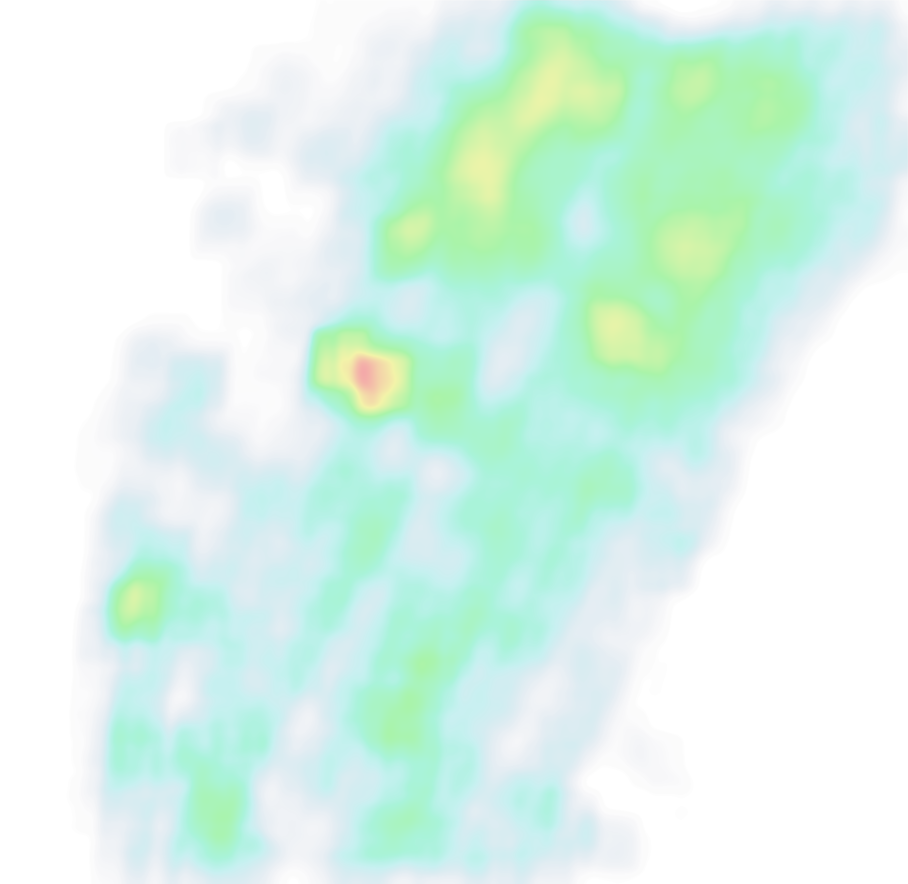

# heat_map_layer

绘制一个热力图，需要先后调用 vega_heatmap 和 heat_map_layer 两个接口，首先使用 vega_heatmap 构建描述热力图渲染样式的 VegaHeatMap 对象，然后使用 heat_map_layer 渲染图像。

## vega_heatmap 

**arctern.util.vega.vega_heatmap(width,height,bounding_box,map_zoom_level,
coordinate_system,aggregation_type)**

&#x2002; &#x2003; 根据给定的配置参数，构建描述热力图渲染样式的 VegaHeatMap 对象。

&#x2002; &#x2003; 参数

&#x2002; &#x2003; &#x2002; &#x2003; * width(int) -- 图片宽度，单位为像素个数。

&#x2002; &#x2003; &#x2002; &#x2003; * height(int) -- 图片高度，单位为像素个数。

&#x2002; &#x2003; &#x2002; &#x2003; * bounding_box(list) -- 图片对应的地理坐标区域，以 [x_min, y_min, x_max, y_max] 的形式表示一个矩形区域。图片左下角的像素坐标 (0, 0) 对应地理坐标 (x_min, y_min) ，图片右上角的像素坐标 (width, height) 对应地理坐标 (x_max, y_max)。

&#x2002; &#x2003; &#x2002; &#x2003; * map_zoom_level(float) -- 热力的辐射范围，与mapbox的地图放大比例相对应，取值范围为 1.0 ~ 15.0。

&#x2002; &#x2003; &#x2002; &#x2003; * coordinate_system(str) -- 可选参数，表示输入数据所属的地理坐标系统，默认值为"EPSG:3857"，当前支持的地理坐标系统请参照 <https://spatialreference.org/>。

&#x2002; &#x2003; &#x2002; &#x2003; * aggregation_type(str) -- 可选参数，表示输入数据到图片像素热力的聚合方式，默认值为"max"。


&#x2002; &#x2003; 返回值类型
   
&#x2002; &#x2003; &#x2002; &#x2003; arctern.util.vega.heatmap.vega_heatmap.VegaHeatMap


&#x2002; &#x2003; 返回

&#x2002; &#x2003; &#x2002; &#x2003; 用于描述渲染样式的 VegaHeatMap 对象。


## heat_map_layer 

**arctern.heat_map_layer(vega, points, weights)**

&#x2002; &#x2003; 根据点的位置和热力值绘制热力图。

&#x2002; &#x2003; 参数

&#x2002; &#x2003; &#x2002; &#x2003; * vega(VegaHeatMap) -- VegaHeatMap 对象。

&#x2002; &#x2003; &#x2002; &#x2003; * points(Series(dtype: object)) -- 点的位置，格式为WKB。

&#x2002; &#x2003; &#x2002; &#x2003; * weights(Series(dtype: float64|int64)) -- 热力值。


&#x2002; &#x2003; 返回值类型
   
&#x2002; &#x2003; &#x2002; &#x2003; bytes


&#x2002; &#x2003; 返回

&#x2002; &#x2003; &#x2002; &#x2003; base64编码的png图片。


### 示例:

  ```python
      >>> import pandas as pd
      >>> import numpy as np
      >>> import arctern
      >>> from arctern.util import save_png
      >>> from arctern.util.vega import vega_heatmap
      >>> 
      >>> # 读取 csv 文件并创建绘图数据
      >>> df = pd.read_csv("test_data.csv", dtype={'longitude':np.float64, 'latitude':np.float64, 'color_weights':np.float64, 'size_weights':np.float64, 'region_boundaries':np.object})
      >>> region = arctern.ST_GeomFromText(pd.Series(['POLYGON ((-74.01424568752932 40.72759334104623, -74.01424568752932 40.76721122683304, -73.96056823889673 40.76721122683304, -73.96056823889673 40.72759334104623, -74.01424568752932 40.72759334104623))']))
      >>> d=pd.DataFrame(region).T
      >>> region = region.append([d]*(df.shape[0] - 1))
      >>> in_region = arctern.ST_Within(arctern.ST_Point(df['longitude'], df['latitude']), region[0])
      >>> df['in_region']=in_region
      >>> input1 = df[df.in_region == True].reset_index()
      >>> 
      >>> points = arctern.ST_Point(input1['longitude'], input1['latitude'])
      >>> 
      >>> # 根据 input1['color_weights'] 绘制热力图
      >>> vega = vega_heatmap(1824, 1777, bounding_box=[-74.01424568752932, 40.72759334104623, -73.96056823889673, 40.76721122683304], map_zoom_level=14.544283200495824, coordinate_system='EPSG:4326')
      >>> png = arctern.heat_map_layer(vega, points, input1['color_weights'])
      >>> save_png(png, "/tmp/python_heatmap.png") 
   ```

渲染结果如下：
