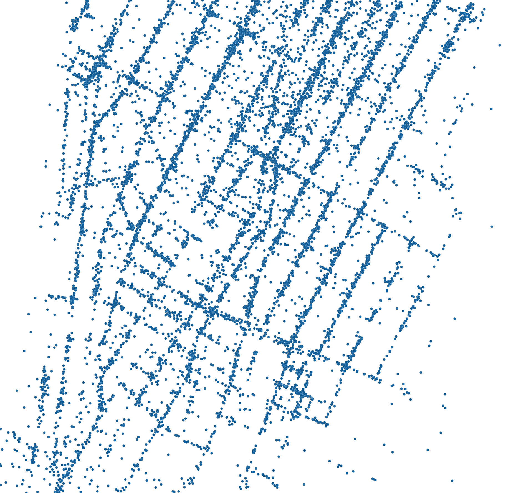

# point_map_layer

绘制一个点图，需要先后调用 vega_pointmap 和 point_map_layer 两个接口，首先使用 vega_pointmap 构建描述点图渲染样式的 VegaPointMap 对象，然后使用 point_map_layer 渲染图像。

## vega_pointmap 

**arctern.util.vega.vega_pointmap(width,height,bounding_box,point_size,point_color,
opacity,coordinate_system)**

&#x2002; &#x2003; 根据给定的配置参数，构建描述点图渲染样式的 VegaPointMap 对象。

&#x2002; &#x2003; 参数

&#x2002; &#x2003; &#x2002; &#x2003; * width(int) -- 图片宽度，单位为像素个数。

&#x2002; &#x2003; &#x2002; &#x2003; * height(int) -- 图片高度，单位为像素个数。

&#x2002; &#x2003; &#x2002; &#x2003; * bounding_box(list) -- 图片对应的地理坐标区域，以 [x_min, y_min, x_max, y_max] 的形式表示一个矩形区域。图片左下角的像素坐标 (0, 0) 对应地理坐标 (x_min, y_min) ，图片右上角的像素坐标 (width, height) 对应地理坐标 (x_max, y_max)。

&#x2002; &#x2003; &#x2002; &#x2003; * point_size(int) -- 可选参数，表示点的直径，默认值为 3。

&#x2002; &#x2003; &#x2002; &#x2003; * point_color(str) -- 可选参数，表示点的颜色，使用十六进制的颜色编码(Hex Color Code)表示，默认值为"#115f9a"。

&#x2002; &#x2003; &#x2002; &#x2003; * opacity(float) -- 可选参数，表示点的不透明度，范围为 0.0 ~ 1.0，默认值为 1.0。

&#x2002; &#x2003; &#x2002; &#x2003; * coordinate_system(str) -- 可选参数，表示输入数据所属的地理坐标系统，默认值为"EPSG:3857"，当前支持的地理坐标系统请参照 <https://spatialreference.org/>。


&#x2002; &#x2003; 返回值类型
   
&#x2002; &#x2003; &#x2002; &#x2003; arctern.util.vega.pointmap.vega_pointmap.VegaPointMap


&#x2002; &#x2003; 返回

&#x2002; &#x2003; &#x2002; &#x2003; 用于描述渲染样式的 VegaPointMap 对象。


## point_map_layer 

**arctern.point_map_layer(vega, points)**

&#x2002; &#x2003; 绘制点图。

&#x2002; &#x2003; 参数

&#x2002; &#x2003; &#x2002; &#x2003; * vega(VegaPointMap) -- VegaPointMap 对象。

&#x2002; &#x2003; &#x2002; &#x2003; * points(Series(dtype: object)) -- 所需绘制的点，格式为WKB。


&#x2002; &#x2003; 返回值类型
   
&#x2002; &#x2003; &#x2002; &#x2003; bytes


&#x2002; &#x2003; 返回

&#x2002; &#x2003; &#x2002; &#x2003; base64编码的png图片。


### 示例:

  ```python
      >>> import pandas as pd
      >>> import numpy as np
      >>> import arctern
      >>> from arctern.util import save_png
      >>> from arctern.util.vega import vega_pointmap
      >>> 
      >>> # 读取 csv 文件并创建绘图数据
      >>> df = pd.read_csv("test_data.csv", dtype={'longitude':np.float64, 'latitude':np.float64, 'color_weights':np.float64, 'size_weights':np.float64, 'region_boundaries':np.object})
      >>> region = arctern.ST_GeomFromText(pd.Series(['POLYGON ((-74.01398981737215 40.71353244267465, -74.01398981737215 40.74480271529791, -73.96979949831308 40.74480271529791, -73.96979949831308 40.71353244267465, -74.01398981737215 40.71353244267465))']))
      >>> d = pd.DataFrame(region).T
      >>> region = region.append([d]*(df.shape[0] - 1))
      >>> in_region = arctern.ST_Within(arctern.ST_Point(df['longitude'], df['latitude']), region[0])
      >>> df['in_region']=in_region
      >>> input1 = df[df.in_region == True].head(10000)
      >>> 
      >>> points = arctern.ST_Point(input1['longitude'], input1['latitude'])
      >>> 
      >>> # 绘制点大小为10，点颜色为#115f9a，点不透明度为0.5的点图
      >>> vega = vega_pointmap(1903, 1777, bounding_box=[-74.01398981737215,40.71353244267465,-73.96979949831308,40.74480271529791], point_size=10, point_color="#115f9a", opacity=1.0, coordinate_system="EPSG:4326")
      >>> png = arctern.point_map_layer(vega, points)
      >>> save_png(png, "/tmp/python_pointmap.png")
   ```

渲染结果如下：
