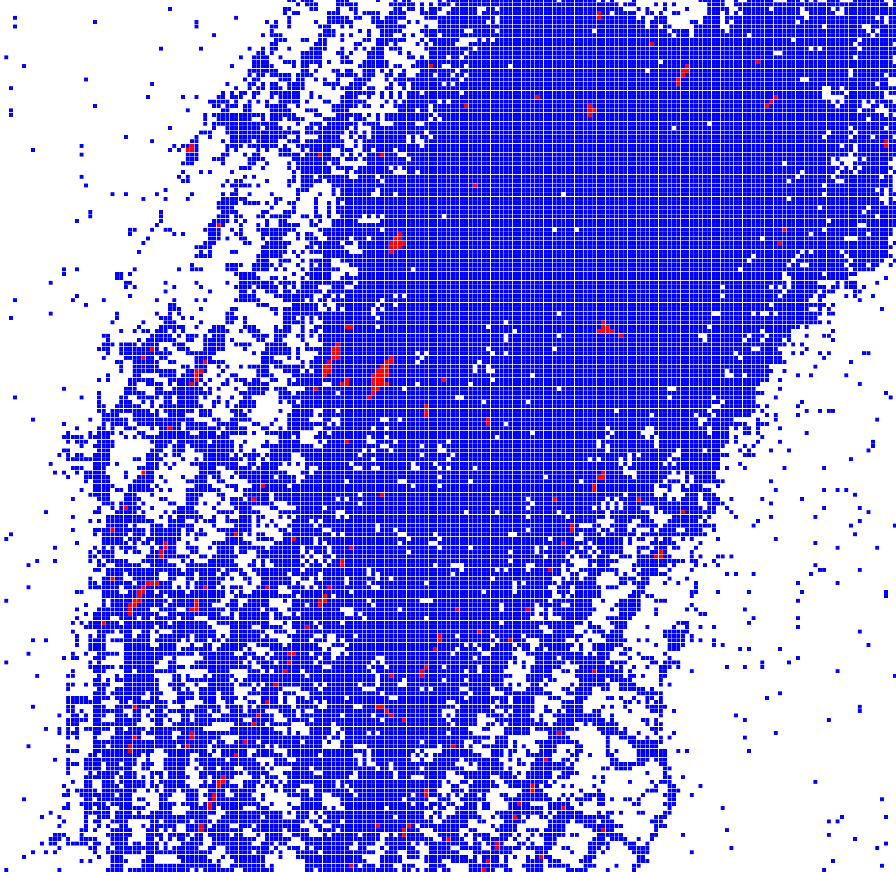

# fishnet_map

绘制一个渔网图。需要先后调用 vega_fishnetmap 和 fishnet_map 两个接口。首先使用 vega_fishnetmap 构建描述渔网图渲染样式的 VegaFishNetMap 对象，然后使用 fishnet_map 渲染图像。

## vega_fishnetmap

**arctern.util.vega.vega_fishnetmap(width,height,bounding_box,color_gradient,
cell_size,cell_spacing,opacity,coordinate_system,aggregation_type)**

&#x2002; &#x2003; 根据给定的配置参数，构建描述渔网图渲染样式的 VegaFishNetMap 对象。

&#x2002; &#x2003; 参数

&#x2002; &#x2003; &#x2002; &#x2003; * width(int) -- 图片宽度，单位为像素个数。

&#x2002; &#x2003; &#x2002; &#x2003; * height(int) -- 图片高度，单位为像素个数。

&#x2002; &#x2003; &#x2002; &#x2003; * bounding_box(list) -- 图片对应的地理坐标区域，以 [x_min, y_min, x_max, y_max] 的形式表示一个矩形区域。图片左下角的像素坐标 (0, 0) 对应地理坐标 (x_min, y_min) ，图片右上角的像素坐标 (width, height) 对应地理坐标 (x_max, y_max)。

&#x2002; &#x2003; &#x2002; &#x2003; * color_gradient(list) -- 渔网网格的颜色渐变范围，表示形式为 ["hex_color"] 或 ["hex_color1", "hex_color2"]。当形式为["hex_color"] 时所有网格的颜色相同。当形式为["hex_color1", "hex_color2"] 时网格的颜色由输入数据中一列的值（权重）决定，且颜色在 "hex_color1" ~ "hex_color2" 之间变化。

&#x2002; &#x2003; &#x2002; &#x2003; * cell_size(int) -- 可选参数，表示渔网网格的边长，单位为像素，默认值为 4。

&#x2002; &#x2003; &#x2002; &#x2003; * cell_spacing(int) -- 可选参数，表示渔网网格之间的间隔，单位为像素，默认值为 1。

&#x2002; &#x2003; &#x2002; &#x2003; * opacity(float) -- 可选参数，表示渔网网格的不透明度，范围为 0.0 ~ 1.0，默认值为 1.0。

&#x2002; &#x2003; &#x2002; &#x2003; * coordinate_system(str) -- 可选参数，表示输入数据所属的地理坐标系统，默认值为"EPSG:3857"，当前支持的地理坐标系统请参照 <https://spatialreference.org/>。

&#x2002; &#x2003; &#x2002; &#x2003; * aggregation_type(str) -- 可选参数，表示输入数据到渔网网格权重的聚合方式，默认值为"sum"。


&#x2002; &#x2003; 返回值类型
   
&#x2002; &#x2003; &#x2002; &#x2003; arctern.util.vega.fishnetmap.vega_fishnetmap.VegaFishNetMap


&#x2002; &#x2003; 返回

&#x2002; &#x2003; &#x2002; &#x2003; 用于描述渲染样式的 VegaFishNetMap 对象。


## fishnet_map

**arctern_pyspark.fishnet_map(vega, points, color_weights)**

&#x2002; &#x2003; 绘制渔网图，权重用于决定渔网网格的颜色。

&#x2002; &#x2003; 参数

&#x2002; &#x2003; &#x2002; &#x2003; * vega(VegaFishNetMap) -- VegaFishNetMap 对象。

&#x2002; &#x2003; &#x2002; &#x2003; * points(WKB) -- 数据点的位置，格式为WKB。

&#x2002; &#x2003; &#x2002; &#x2003; * color_weights(int|float) -- 数据点的颜色权重。


&#x2002; &#x2003; 返回值类型
   
&#x2002; &#x2003; &#x2002; &#x2003; bytes


&#x2002; &#x2003; 返回

&#x2002; &#x2003; &#x2002; &#x2003; base64编码的png图片。


### 示例:

  ```python
      >>> from arctern.util import save_png
      >>> from arctern.util.vega import vega_fishnetmap
      >>> from arctern_pyspark import register_funcs
      >>> from arctern_pyspark import fishnetmap
      >>> from pyspark.sql import SparkSession
      >>> 
      >>> spark = SparkSession.builder.appName("Python Arrow-in-Spark example").getOrCreate()
      >>> spark.conf.set("spark.sql.execution.arrow.pyspark.enabled", "true")
      >>> 
      >>> # test_data.csv下载链接: https://github.com/zilliztech/arctern-resources/raw/benchmarks/benchmarks/dataset/layer_rendering_test_data/test_data.csv
      >>> table_df = spark.read.format("csv").option("header", True).option("delimiter", ",").schema("longitude double, latitude double, color_weights double, size_weights double, region_boundaries string").load("file:///path/to/test_data.csv").cache()
      >>> table_df.createOrReplaceTempView("test_table")
      >>> 
      >>> register_funcs(spark)
      >>> 
      >>> # df 是包含 2 列数据的 pyspark.Dataframe，第一列为 WKB 类型的points，第二列为权重值
      >>> # 根据 color_weights 绘制渔网图
      >>> df = spark.sql("select ST_Point(longitude, latitude) as point, color_weights from test_table where ST_Within(ST_Point(longitude, latitude), ST_GeomFromText('POLYGON ((-74.01424568752932 40.72759334104623, -74.01424568752932 40.76721122683304, -73.96056823889673 40.76721122683304, -73.96056823889673 40.72759334104623, -74.01424568752932 40.72759334104623))'))")
      >>> vega = vega_fishnetmap(1824, 1777, bounding_box=[-74.01424568752932, 40.72759334104623, -73.96056823889673, 40.76721122683304], cell_size=10, cell_spacing=2, opacity=1.0, coordinate_system="EPSG:4326")
      >>> res = fishnetmap(vega, df)
      >>> save_png(res, '/tmp/fishnetmap.png')
      >>> 
      >>> spark.sql("show tables").show()
      >>> spark.catalog.dropGlobalTempView("test_table")
   ```

渲染结果如下：
