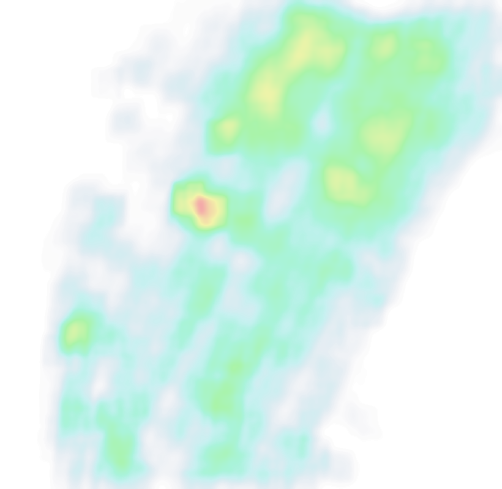

# heatmap

绘制一个热力图，需要先后调用 vega_heatmap 和 heatmap 两个接口，首先使用 vega_heatmap 构建描述热力图渲染样式的 VegaHeatMap 对象，然后使用 heatmap 渲染图像。

## vega_heatmap

**arctern.util.vega.vega_heatmap(width,height,bounding_box,map_zoom_level,
coordinate_system,aggregation_type)**

&#x2002; &#x2003; 根据给定的配置参数，构建描述热力图渲染样式的 VegaHeatMap 对象。

&#x2002; &#x2003; 参数

&#x2002; &#x2003; &#x2002; &#x2003; * width(int) -- 图片宽度，单位为像素个数。

&#x2002; &#x2003; &#x2002; &#x2003; * height(int) -- 图片高度，单位为像素个数。

&#x2002; &#x2003; &#x2002; &#x2003; * bounding_box(list) -- 图片对应的地理坐标区域，以 [x_min, y_min, x_max, y_max] 的形式表示一个矩形区域。图片左下角的像素坐标 (0, 0) 对应地理坐标 (x_min, y_min) ，图片右上角的像素坐标 (width, height) 对应地理坐标 (x_max, y_max)。

&#x2002; &#x2003; &#x2002; &#x2003; * map_zoom_level(float) -- 热力的辐射范围，与mapbox的地图放大比例相对应，取值范围为 1.0 ~ 15.0。

&#x2002; &#x2003; &#x2002; &#x2003; * coordinate_system(str) -- 可选参数，表示输入数据所属的地理坐标系统，默认值为"EPSG:3857"，当前支持的地理坐标系统请参照 <https://spatialreference.org/>。

&#x2002; &#x2003; &#x2002; &#x2003; * aggregation_type(str) -- 可选参数，表示输入数据到图片像素热力的聚合方式，默认值为"max"。


&#x2002; &#x2003; 返回值类型
   
&#x2002; &#x2003; &#x2002; &#x2003; arctern.util.vega.heatmap.vega_heatmap.VegaHeatMap


&#x2002; &#x2003; 返回

&#x2002; &#x2003; &#x2002; &#x2003; 用于描述渲染样式的 VegaHeatMap 对象。


## heatmap

**arctern_pyspark.heatmap(vega, points, weights)**

&#x2002; &#x2003; 根据点的位置和热力值绘制热力图。

&#x2002; &#x2003; 参数

&#x2002; &#x2003; &#x2002; &#x2003; * vega(VegaHeatMap) -- VegaHeatMap 对象。

&#x2002; &#x2003; &#x2002; &#x2003; * points(WKB) -- 点的位置，格式为WKB。

&#x2002; &#x2003; &#x2002; &#x2003; * weights(int|float) -- 热力值。


&#x2002; &#x2003; 返回值类型
   
&#x2002; &#x2003; &#x2002; &#x2003; bytes


&#x2002; &#x2003; 返回

&#x2002; &#x2003; &#x2002; &#x2003; base64编码的png图片。


### 示例:

  ```python
      >>> from arctern.util import save_png
      >>> from arctern.util.vega import vega_heatmap
      >>> from arctern_pyspark import register_funcs
      >>> from arctern_pyspark import heatmap
      >>> from pyspark.sql import SparkSession
      >>> 
      >>> spark = SparkSession.builder.appName("Python Arrow-in-Spark example").getOrCreate()
      >>> spark.conf.set("spark.sql.execution.arrow.pyspark.enabled", "true")
      >>> 
      >>> # test_data.csv下载链接: https://github.com/zilliztech/arctern-resources/raw/benchmarks/benchmarks/dataset/layer_rendering_test_data/test_data.csv
      >>> table_df = spark.read.format("csv").option("header", True).option("delimiter", ",").schema(
      "longitude double, latitude double, color_weights double, size_weights double, region_boundaries string").load(
      "file:///tmp/test_data.csv").cache()
      >>> table_df.createOrReplaceTempView("test_table")
      >>> 
      >>> register_funcs(spark)
      >>> 
      >>> # df 是包含 2 列数据的 pyspark.Dataframe，第一列为 WKB 类型的points，第二列为热力值
      >>> # 根据 color_weights 绘制热力图      
      >>> df = spark.sql("select ST_Point(longitude, latitude) as point, color_weights from test_table where ST_Within(ST_Point(longitude, latitude), ST_GeomFromText('POLYGON ((-74.01424568752932 40.72759334104623, -74.01424568752932 40.76721122683304, -73.96056823889673 40.76721122683304, -73.96056823889673 40.72759334104623, -74.01424568752932 40.72759334104623))'))")
      >>> vega = vega_heatmap(1824, 1777, bounding_box=[-74.01424568752932, 40.72759334104623, -73.96056823889673, 40.76721122683304], map_zoom_level=14.544283200495824, coordinate_system='EPSG:4326')
      >>> res = heatmap(vega, df)
      >>> save_png(res, '/tmp/heatmap.png')
      >>> 
      >>> spark.sql("show tables").show()
      >>> spark.catalog.dropGlobalTempView("test_table")
   ```

渲染结果如下：
