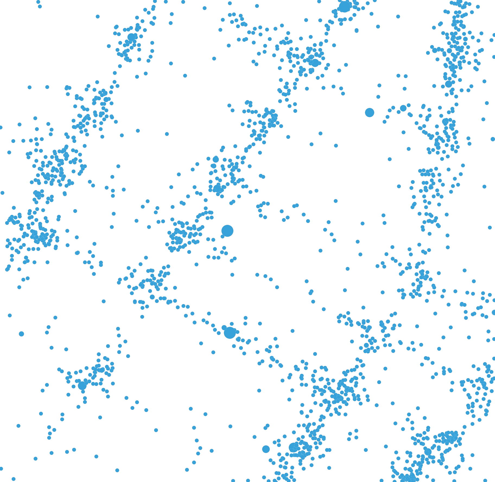
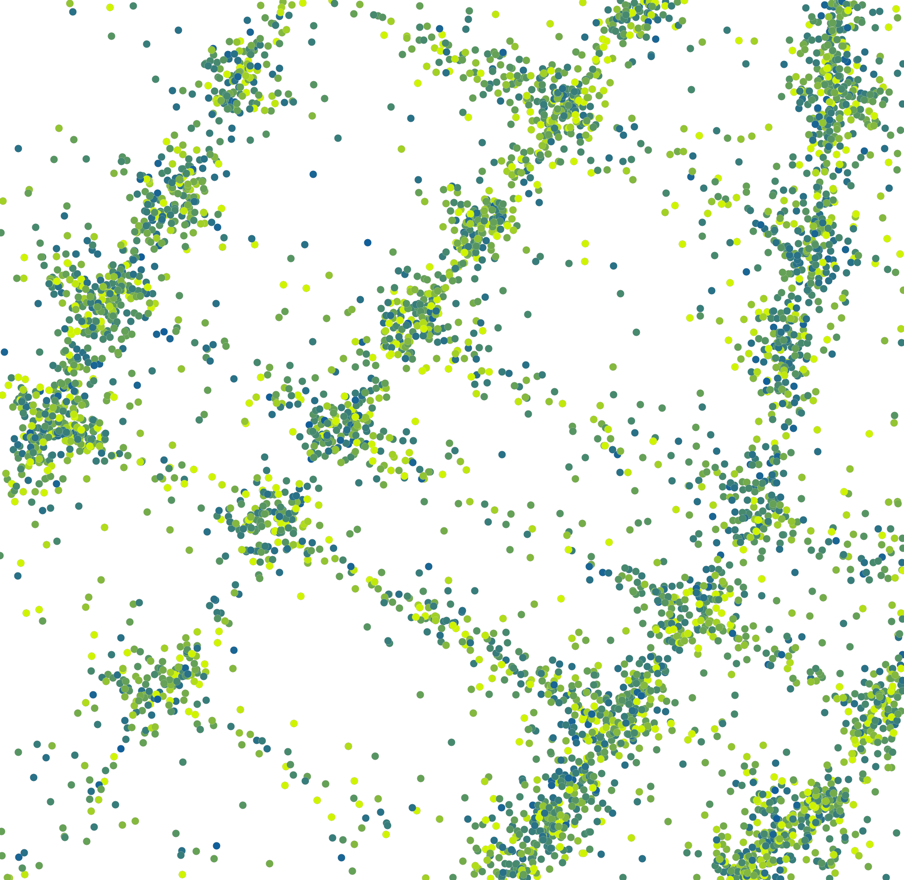

# weighted_pointmap

绘制一个带权点图。需要先后调用 vega_weighted_pointmap 和 weighted_pointmap 两个接口。首先使用 vega_weighted_pointmap 构建描述带权点图渲染样式的 VegaWeightedPointMap 对象，然后使用 weighted_pointmap 渲染图像。

## vega_weighted_pointmap

**arctern.util.vega.vega_weighted_pointmap(width,height,bounding_box,color_gradient,
color_bound,size_bound,opacity,coordinate_system)**

&#x2002; &#x2003; 根据给定的配置参数，构建描述带权点图渲染样式的 VegaWeightedPointMap 对象。

&#x2002; &#x2003; 参数

&#x2002; &#x2003; &#x2002; &#x2003; * width(int) -- 图片宽度，单位为像素个数。

&#x2002; &#x2003; &#x2002; &#x2003; * height(int) -- 图片高度，单位为像素个数。

&#x2002; &#x2003; &#x2002; &#x2003; * bounding_box(list) -- 图片对应的地理坐标区域，以 [x_min, y_min, x_max, y_max] 的形式表示一个矩形区域。图片左下角的像素坐标 (0, 0) 对应地理坐标 (x_min, y_min) ，图片右上角的像素坐标 (width, height) 对应地理坐标 (x_max, y_max)。

&#x2002; &#x2003; &#x2002; &#x2003; * color_gradient(list) -- 点的颜色渐变范围，表示形式为 ["hex_color"] 或 ["hex_color1", "hex_color2"]。当形式为["hex_color"] 时所有点的颜色相同。当形式为["hex_color1", "hex_color2"] 时点的颜色由输入数据中一列的值（权重）决定，且颜色在 "hex_color1" ~ "hex_color2" 之间变化。

&#x2002; &#x2003; &#x2002; &#x2003; * color_bound(list) -- 可选参数，用于描述权重与颜色的对应关系，仅当color_gradient中包含两个颜色值时需要设置，表示形式为 [color_min, color_max]。权重值小于等于 color_min 时点的颜色为"hex_color1"， 权重值大于等于 color_max 时点的颜色为"hex_color2"。

&#x2002; &#x2003; &#x2002; &#x2003; * size_bound(list) -- 可选参数，用于描述点的直径范围，表示形式为 [diameter] 或 [diameter_min, diameter_max]，默认值为[3]。[diameter] 形式表示所有点的直径都为 diameter; [diameter_min, diameter_max] 形式表示点的直径由输入数据中一列的值（权重）决定，且在 diameter_min ~ diameter_max 之间变化; 权重值小于等于 diameter_min 时点的直径为 diameter_min，权重值大于等于 diameter_max 时点的直径为 diameter_max; 权重值在 diameter_min ~ diameter_max 之间时点的直径与权重值相等。

&#x2002; &#x2003; &#x2002; &#x2003; * opacity(float) -- 可选参数，表示点的不透明度，范围为 0.0 ~ 1.0，默认值为 1.0。

&#x2002; &#x2003; &#x2002; &#x2003; * coordinate_system(str) -- 可选参数，表示输入数据所属的地理坐标系统，默认值为"EPSG:3857"，当前支持的地理坐标系统请参照 <https://spatialreference.org/>。


&#x2002; &#x2003; 返回值类型
   
&#x2002; &#x2003; &#x2002; &#x2003; arctern.util.vega.pointmap.vega_weighted_pointmap.VegaWeightedPointMap


&#x2002; &#x2003; 返回

&#x2002; &#x2003; &#x2002; &#x2003; 用于描述渲染样式的 VegaWeightedPointMap 对象。


## weighted_pointmap

**arctern_pyspark.weighted_pointmap(vega, points, color_weights, size_weights)**

&#x2002; &#x2003; 绘制带权重的点图，权重用于决定点的大小和颜色。

&#x2002; &#x2003; 参数

&#x2002; &#x2003; &#x2002; &#x2003; * vega(VegaWeightedPointMap) -- VegaWeightedPointMap 对象。

&#x2002; &#x2003; &#x2002; &#x2003; * points(WKB) -- 所需绘制的点，格式为WKB。

&#x2002; &#x2003; &#x2002; &#x2003; * color_weights(int|float) -- 可选参数，点的颜色权重。

&#x2002; &#x2003; &#x2002; &#x2003; * size_weights(int|float) -- 可选参数，点的大小权重。


&#x2002; &#x2003; 返回值类型
   
&#x2002; &#x2003; &#x2002; &#x2003; bytes


&#x2002; &#x2003; 返回

&#x2002; &#x2003; &#x2002; &#x2003; base64编码的png图片。


### 示例:

  ```python
      >>> from arctern.util import save_png
      >>> from arctern.util.vega import vega_weighted_pointmap
      >>> from arctern_pyspark import register_funcs
      >>> from arctern_pyspark import weighted_pointmap
      >>> from pyspark.sql import SparkSession
      >>> 
      >>> spark = SparkSession.builder.appName("Python Arrow-in-Spark example").getOrCreate()
      >>> spark.conf.set("spark.sql.execution.arrow.pyspark.enabled", "true")
      >>> 
      >>> # test_data.csv下载链接: https://github.com/zilliztech/arctern-resources/raw/benchmarks/benchmarks/dataset/layer_rendering_test_data/test_data.csv
      >>> table_df = spark.read.format("csv").option("header", True).option("delimiter", ",").schema(
      "longitude double, latitude double, color_weights double, size_weights double,region_boundaries string").load(
      "file:///path/to/test_data.csv").cache()
      >>> table_df.createOrReplaceTempView("test_table")
      >>> 
      >>> register_funcs(spark)
      >>> 
      >>> # df1 是包含 2 列数据的 pyspark.Dataframe，第一列为 WKB 类型的points，第二列为点颜色的权重数据
      >>> # 绘制带权点图，点的颜色根据 color_weights 在 "#115f9a" ~ "#d0f400" 之间变化，点的大小为 16   
      >>> df1 = spark.sql("SELECT ST_Point (longitude, latitude) AS point, color_weights FROM test_table WHERE (ST_Within (ST_Point (longitude, latitude), ST_GeomFromText('POLYGON ((-73.99668712186558 40.72972339069935, -73.99668712186558 40.7345193345495, -73.99045479584949 40.7345193345495, -73.99045479584949 40.72972339069935, -73.99668712186558 40.72972339069935))'))) LIMIT 20000")
      >>> vega1 = vega_weighted_pointmap(1740, 1767, bounding_box=[-73.99668712186558,40.72972339069935,-73.99045479584949,40.7345193345495], color_gradient=["#115f9a", "#d0f400"], color_bound=[2.5,15], size_bound=[16], opacity=1.0, coordinate_system="EPSG:4326")
      >>> res1 = weighted_pointmap(vega1, df1)
      >>> save_png(res1, '/tmp/weighted_pointmap_1_0.png')
      >>> 
      >>> # df2 是包含 2 列数据的 pyspark.Dataframe，第一列为 WKB 类型的points，第二列为点大小的权重数据
      >>> # 绘制带权点图，点的颜色为'#37A2DA'，点的大小根据 size_weights 在 15 ~ 50 之间变化      
      >>> df2 = spark.sql("SELECT ST_Point (longitude, latitude) AS point, size_weights FROM test_table WHERE (ST_Within (ST_Point (longitude, latitude), ST_GeomFromText('POLYGON ((-73.99668712186558 40.72972339069935, -73.99668712186558 40.7345193345495, -73.99045479584949 40.7345193345495, -73.99045479584949 40.72972339069935, -73.99668712186558 40.72972339069935))'))) LIMIT 2000")
      >>> vega2 = vega_weighted_pointmap(1740, 1767, bounding_box=[-73.99668712186558,40.72972339069935,-73.99045479584949,40.7345193345495], color_gradient=["#37A2DA"], size_bound=[15, 50], opacity=1.0, coordinate_system="EPSG:4326")
      >>> res2 = weighted_pointmap(vega2, df2)
      >>> save_png(res2, '/tmp/weighted_pointmap_0_1.png')
      >>> 
      >>> # df3 是包含 3 列数据的 pyspark.Dataframe，第一列为 WKB 类型的points，第二列为点颜色的权重数据，第三列为点大小的权重数据
      >>> # 绘制带权点图，点的颜色根据 color_weights 在 "#115f9a" ~ "#d0f400" 之间变化，点的大小根据 size_weights 在 15 ~ 50 之间变化      
      >>> df3 = spark.sql("SELECT ST_Point (longitude, latitude) AS point, color_weights, size_weights FROM test_table WHERE (ST_Within (ST_Point (longitude, latitude), ST_GeomFromText('POLYGON ((-73.99668712186558 40.72972339069935, -73.99668712186558 40.7345193345495, -73.99045479584949 40.7345193345495, -73.99045479584949 40.72972339069935, -73.99668712186558 40.72972339069935))'))) LIMIT 2000")
      >>> vega3 = vega_weighted_pointmap(1740, 1767, bounding_box=[-73.99668712186558,40.72972339069935,-73.99045479584949,40.7345193345495], color_gradient=["#115f9a", "#d0f400"], color_bound=[2.5,15], size_bound=[15, 50], opacity=1.0, coordinate_system="EPSG:4326")
      >>> res3 = weighted_pointmap(vega3, df3)
      >>> save_png(res3, '/tmp/weighted_pointmap_1_1.png')
      >>> 
      >>> spark.sql("show tables").show()
      >>> spark.catalog.dropGlobalTempView("test_table")
   ```

渲染结果如下：




